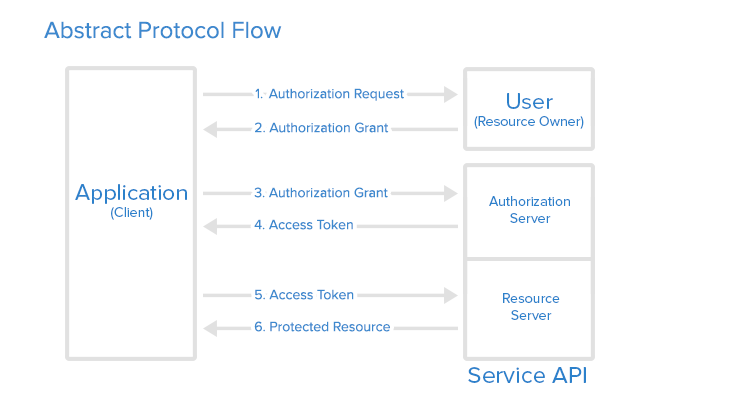

# OAuth2 Server Library
OAuth2 Java Server Library is a backbone of OAuth2 provider which will provide basic OAuth2 support.    

**Please note**: We take oauth2-server's security and our users' trust very seriously. If you believe you have found a security issue in oauth2-server library, _please responsibly disclose_ by contacting us at [tiler@clouway.com](mailto:tiler@clouway.com).

# Build Status
[](https://travis-ci.org/clouway/oauth2-server)

# Supported Flows
 * Client authorization with authorization_code
 
 
 
 * 2-legged oauth2 authorization with JWT
 
 # Example config servlet for usage of the OAuth2 server library
 ## OAuth2SupportServlet
 ```Java
class OAuth2SupportServlet extends OAuth2Servlet {
  private final OAuth2Config config;
  public OAuth2SupportServlet(OAuth2Config config) {
      this.config = config;
  }
  public getConfig() {
      return config;
   }
}

// usage
ServletContext servletContext = servletContextEvent.getServletContext();
servletContext.addServlet("oauth2", 
       new OAuth2SupportServlet(OAuth2Config.newConfig()
            .tokens(tokens)
            .jwtKeyStore(jwtKeyStore)
            .keyStore(keyStore)
            .identityFinder(identityFinder)
            .resourceOwnerIdentityFinder(resourceOwnerIdentityFinder)
            .clientAuthorizationRepository(clientAuthorizationRepository)
            .clientFinder(clientFinder)
            .loginPageUrl("/ServiceLogin?continue=")
            .build())
        .addMapping("/o/oauth2/v1/*");
 
 ```

## The responding interfaces are responsible for:

* IdentityFinder - Used to find the identity of the client that is requesting authorization. 

* ClientAuthorizationRepository - Used to generate and persist auth codes for authorized clients and to use them later in the Access token request step.

* Tokens - Used to generate Access and Refresh tokens and persist them for later use when a protected resource is requested. 

* JwtKeyStore - Used to find the Key blocks for verifying JWT authorizations

* KeyStore - Used to find the keys used for signing and verifying of the signatures of the id_tokens.

* ResourceOwnerIdentityFinder - Used during the authorization of the request to find the identity.
   
* ClientFinder - Used to persist and find OAuth Clients 


## Endpoints in the OAuth2Servlet

For example if you bind your OAuth2Servlet to *`/o/oauth2/v1/*`* 
* `/o/oauth2/v1/auth` - Used for Authorization codes

* `/o/oauth2/v1/token` - Used for Access and Refresh tokens

* `/o/oauth2/v1/revoke` - Used to revoke Access/Refresh tokens

* `/o/oauth2/v1/tokenInfo` Used to receive an id_token for the given Access token

* `/o/oauth2/v1/userInfo` Used to receive a UserInfo for the given Access token

* `/o/oauth2/v1/certs` Used to receive the used certificates

## id_token
Our library supports the OpenID id_token (http://openid.net/specs/openid-connect-core-1_0.html) which could be obtained on the tokenInfo endpoint. Note that for optimisation purposes to lower round trips an id_token is also returned with the refresh token response and jwt token response. The id_token uses a custom header CID (Certificate ID) that can be used to recognise which certificate was used to sign the token.

## Releasing
```
bazel run --stamp --define "maven_repo=https://oss.sonatype.org/content/repositories/snapshots/" --define "maven_user=youruser" --define "maven_password=yourpassword"  --define gpg_sign=true //oauth2-server:exported_lib.publish`
```

# ToDo
 * dependency clean up

# License
Copyright 2022 clouWay ood.

Licensed under the Apache License, Version 2.0 (the "License");
you may not use this file except in compliance with the License.
You may obtain a copy of the License at

   https://www.apache.org/licenses/LICENSE-2.0

Unless required by applicable law or agreed to in writing, software
distributed under the License is distributed on an "AS IS" BASIS,
WITHOUT WARRANTIES OR CONDITIONS OF ANY KIND, either express or implied.
See the License for the specific language governing permissions and
limitations under the License.

